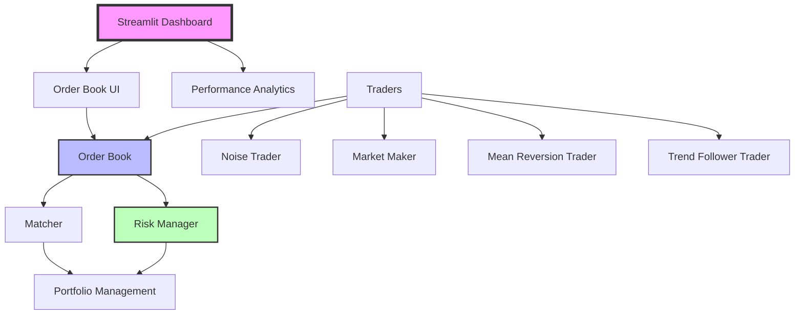

# Cherubin Exchange: Portfolio Evaluation & Trading Simulation

  
*Image: Financial markets visualization - Source: Unsplash*

Cherubin Exchange is a modular, extensible framework designed to simulate financial market dynamics and evaluate the performance of automated trading strategies. The project provides a sandboxed environment where various trading agents—from simple noise traders to complex institutional execution algorithms—interact within a simulated order book.

## 🚀 Overview

The goal of Cherubin Exchange is to bridge the gap between theoretical strategy development and realistic market execution. By simulating not just price movement, but the underlying order book mechanics, PETS allows developers to observe how strategies impact market liquidity and respond to different volatility regimes.

## ✨ Key Features

- **Multi-Agent Simulation**: Support for diverse trader archetypes (Noise, Trend Followers, Market Makers, Mean Reversion, etc.).
- **Order Book Dynamics**: A centralized exchange simulation that handles limit and market orders.
- **Pluggable Strategies**: An abstract interface for implementing and testing custom trading logic.
- **Risk Management Engine**: Built-in safeguards to monitor margin, position limits, and drawdowns (now implemented).
- **Performance Analytics**: Detailed tracking of Sharpe Ratio, Max Drawdown, PnL per agent, and comparative ranking with individual trader details and thematic icons.

## 🛠️ Technology Stack

Cherubin Exchange is built using modern Python technologies for robust simulation and visualization:

- **Core Language**: Python 3.8+
- **Web Framework**: Streamlit - For interactive dashboard and real-time visualization
- **Data Processing**: 
  - Pandas - Data manipulation and analysis
  - NumPy - Numerical computations and performance optimization
- **Visualization**: Matplotlib - Charts and graphs for price evolution and depth analysis
- **Caching**: functools.lru_cache and Streamlit's st.cache_data for performance optimization
- **Risk Management**: Custom-built engine with configurable margin, position, and drawdown limits
- **Architecture**: Object-oriented design with modular trader classes and matching engine

## 🏗️ Project Architecture

The following Mermaid diagram illustrates the high-level architecture of Cherubin Exchange:



*To generate this diagram as an image, copy the Mermaid code above and use an online Mermaid renderer like [Mermaid Live Editor](https://mermaid.live) or integrate it into your documentation tool.*

  
*Replace with actual Mermaid-generated image*

## 📁 Project Structure

```text
Cherubin Exchange/
├── app.py                     # Main application entry point
├── demo_risk.py              # Risk management demonstration script
├── requirements.txt          # Python dependencies
├── README.md                 # Project documentation
├── image/                    # Static assets and images
├── matching_engine/          # Core order book and matching logic
│   ├── matcher.py           # Trade matching engine
│   ├── order_book.py        # Order book implementation with risk integration
│   └── order.py             # Order data structure
├── simulation/               # Trading simulation components
│   ├── trader_base.py       # Abstract trader base class
│   ├── random_traders.py    # Trader generation utilities
│   ├── market_maker.py      # Market making strategy
│   ├── noise_trader.py      # Random noise trading strategy
│   ├── mean_reversion_trader.py  # Mean reversion strategy
│   ├── trend_follower_trader.py  # Trend following strategy
│   ├── portfolio.py         # Portfolio management with history tracking
│   ├── performance.py       # Performance metrics calculation
│   └── risk_manager.py      # Risk management engine
└── visualization/           # UI and visualization components
    └── order_book_UI.py     # Streamlit dashboard interface
```

## 🚀 Getting Started

1. **Install Dependencies**: 
   ```bash
   pip install -r requirements.txt
   ```

2. **Run the Simulation**:
   ```bash
   streamlit run app.py
   ```

3. **View Risk Management Demo**:
   ```bash
   python demo_risk.py
   ```

4. **Access the Dashboard**: Open your browser to the Streamlit URL (typically `http://localhost:8501`)

## 📊 Screenshots

  
*Main dashboard showing order book, price chart, and trader performance*

  
*Risk management engine demonstration output*

## 🐛 Issues Encountered During Development

During the development of Cherubin Exchange, we encountered and resolved several technical challenges:

1. **Performance Bottlenecks**: Initial implementation suffered from unlimited history growth in portfolios and frequent UI re-renders. **Solution**: Implemented history limits (max 1000 records) and batch display updates to improve responsiveness.

2. **Streamlit Caching Errors**: Early versions had issues with `st.cache_data` not properly handling mutable objects. **Solution**: Used underscore-prefixed parameters (`_order_book`) to prevent hashing and switched to `functools.lru_cache` for static data.

3. **Image Encoding Overhead**: Trader icons were initially loaded as base64-encoded images, causing slow rendering. **Solution**: Replaced with lightweight emoji icons (👼😇✨🌟🤖) for better performance.

4. **Memory Usage**: Unlimited growth of trade and price histories led to high memory consumption. **Solution**: Added configurable limits and periodic cleanup in portfolio management.

5. **Deprecation Warnings**: Streamlit API changes required updates to caching and UI components. **Solution**: Updated to latest Streamlit version and refactored deprecated methods.

6. **Order Book Synchronization**: Race conditions between trader orders and risk checks. **Solution**: Integrated risk manager directly into order book operations with atomic checks.

7. **Visualization Scaling**: Charts became unresponsive with large datasets. **Solution**: Implemented sampling and downsampling for historical data display.

## 🤝 Contributing

We welcome contributions! Please:

1. Fork the repository
2. Create a feature branch
3. Add tests for new functionality
4. Ensure all tests pass
5. Submit a pull request

## 📄 License

This project is licensed under the MIT License - see the [LICENSE](LICENSE) file for details.

## 🙏 Acknowledgments

- Inspired by real-world trading systems and market microstructure research
- Built with ❤️ for educational and research purposes
- Special thanks to the open-source community for Streamlit, Pandas, and NumPy

---

*Cherubin Exchange - Simulating markets, one trade at a time.*